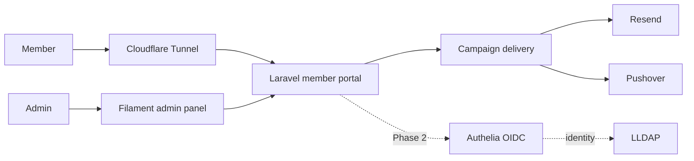

# Solamnia Member Portal

[](https://github.com/SturmB/solamnia-portal/actions/workflows/tests.yml)
[](https://github.com/SturmB/solamnia-portal/actions/workflows/lint.yml)
[](https://github.com/SturmB/solamnia-portal/actions/workflows/docker.yml)

The member-facing gateway for my self-hosted services. Solamnia gives invited
friends and family one considered place to access services, receive occasional
updates, and eventually manage a federated identity without operator
hand-holding.

**[View the live portal](https://solamnia.tv/)**

> **Project status:** Active development. The newsletter and campaign-delivery
> foundation is implemented and deployed. Federated member login, automated
> invitations, service access, and the knowledge base are the next phases.

## What is implemented

- A Filament 5 administration panel for composing, previewing, scheduling, and
  sending newsletter campaigns.
- MJML email rendering, signed view-in-browser and unsubscribe links, subscriber
  opt-out handling, and idempotent scheduled delivery.
- Pest coverage for campaign rendering and delivery, authentication, signed URLs
  behind a reverse proxy, profile settings, and panel access.
- PHPStan, Pint, Prettier, and automated tests in CI across PHP 8.4 and 8.5.
- A container pipeline that publishes immutable and rolling images to GHCR, plus
  a production Compose stack with Laravel, a scheduler, and MySQL 8.4.
- Architecture decision records and a project-wide domain language for keeping
  identity, membership, newsletter, and administration concerns explicit.

## Architecture direction



The portal is intentionally **not** a second identity silo. The planned member
flow treats LLDAP as the identity source, Authelia as the OIDC provider, and the
portal's user row as a local shadow bound to the provider subject. A local
Fortify login remains only as break-glass access for the administrator.

The decisions and trade-offs are recorded in [`docs/adr`](docs/adr), including
federated identity, homelab deployment, campaign delivery, and the membership
model.

## Stack

- **Application:** PHP 8.4/8.5 · Laravel 13 · Livewire 4 · Flux UI 2 ·
  Filament 5
- **Quality:** Pest 4 · Larastan/PHPStan · Laravel Pint · Prettier
- **Frontend:** Tailwind CSS 4 · Vite 8 · MJML
- **Delivery:** GitHub Actions · Docker · GHCR · MySQL 8.4 · Cloudflare Tunnel
- **Integrations:** Resend · Pushover · planned Authelia/LLDAP federation

## Local development

### Prerequisites

- PHP 8.4 or 8.5 with Composer
- Node.js 22 and npm
- SQLite for the default local configuration
- Valid Flux UI Composer credentials for the licensed dependency

### Setup

```bash
git clone git@github.com:SturmB/solamnia-portal.git
cd solamnia-portal

composer config http-basic.composer.fluxui.dev "$FLUX_USERNAME" "$FLUX_LICENSE_KEY"
composer install

cp .env.example .env
touch database/database.sqlite
php artisan key:generate
php artisan migrate

npm install
npm run build
php artisan test
```

Run the development services together with:

```bash
composer run dev
```

The default `.env.example` uses local SQLite and log-based mail delivery. Live
mail, notifications, identity infrastructure, and production deployment require
separate protected configuration; no credentials belong in the repository.

## Delivery and verification

Every push to `main` runs the test and formatting workflows. The container
workflow builds the deployable image and publishes both a rolling `latest` tag
and an immutable commit-based tag for rollback. GitHub Actions dependencies are
pinned to exact revisions rather than floating tags.

Production is reachable only through the Cloudflare Tunnel; the application
container does not publish a host port. The MySQL port is bound to host loopback
for controlled SSH-tunnel access rather than exposed to the LAN.

## Project documentation

- [`PRODUCT.md`](PRODUCT.md) — product purpose, users, design principles, and
  accessibility goals
- [`CONTEXT.md`](CONTEXT.md) — the project's domain language and operational
  context
- [`docs/adr`](docs/adr) — architectural decisions and their consequences
- [`compose.yaml`](compose.yaml) — the documented production deployment shape

This is a personal homelab application rather than a general-purpose hosted
service. Its public repository is intended to make the architecture, delivery
practices, and implementation quality inspectable.
